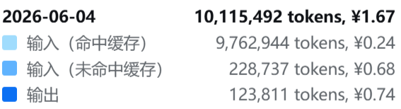

# seemingly_useless_tools

Small utilities that are probably useless until the exact five-minute moment when they are not.

This repository collects a small set of utilities and related files.

The list below reflects the current contents and can grow over time:

- `gjf_swap.py` — reorder selected atoms in a Gaussian `.gjf` input file.
- `mol_box.py` — calculate simple molecular simulation box composition, density, volume, and cubic box length.
- `deepseek-pricing-extension.zip` — Chrome extension for adding prices to DeepSeek Usage token tooltips.
- `bilibili-tab-sorter.zip` — Chrome extension for sorting open Bilibili tabs by video duration.

The Python-based tools use only the Python standard library.

The browser extensions are packaged as zip archives in the repository root for easy download and unpacking.

---

## Requirements

- Python 3.8 or newer is recommended.
- No third-party packages are required.

On Windows PowerShell, Linux bash, or macOS zsh/bash, quote arguments that contain commas, colons, braces, or dashes when needed.

---

## `gjf_swap.py`

### Purpose

`gjf_swap.py` works with Gaussian-style `.gjf` files and related simple coordinate inputs: it detects the coordinate block, prints the molecular formula and atom count, and moves selected atoms to either the top or bottom of the atom list.

The selected atoms are moved as full coordinate lines, so the element name and its coordinates stay together.

### Basic `.gjf` assumption

The script assumes a common Gaussian input layout:

```text
%chk=...
%nprocshared=...
# method/basis options

Title

0 1
C     x     y     z
H     x     y     z
...
```

It also works with simple internal-coordinate style atom lines as long as each coordinate line starts with an element symbol.

### Usage

```bash
python gjf_swap.py -f input.gjf -atoms "1,3-5" -t
```

or:

```bash
python gjf_swap.py -f input.gjf -o output.gjf -atoms "1,3-5" -b -v
```

If no arguments are given, the script enters interactive mode.

### Options

| Option | Meaning |
| --- | --- |
| `-f FILE` | Input `.gjf` file. |
| `-o FILE` | Output `.gjf` file. Default: overwrite the input file. |
| `-atoms SPEC` | Atom indices to move, using commas and ranges, e.g. `"1,3-5,7"`. |
| `-t` | Move selected atoms to the top of the coordinate block. |
| `-b` | Move selected atoms to the bottom of the coordinate block. |
| `-v` | Verbose mode: print the atom list and new ordering. |
| `-h`, `--help` | Show help message. |

### Examples

Move atoms 1, 3, 4, and 5 to the top:

```bash
python gjf_swap.py -f molecule.gjf -o molecule_top.gjf -atoms "1,3-5" -t
```

Move atoms 2 and 8 to the bottom and print the atom order:

```bash
python gjf_swap.py -f molecule.gjf -o molecule_bottom.gjf -atoms "2,8" -b -v
```

### Notes

- Atom indices are 1-based.
- Atom selections are sorted internally, so `"1,3"` and `"3,1"` currently produce the same result.
- The molecular formula is printed in a simple Hill-like order: C first, H second, then other elements alphabetically.

---

## `mol_box.py`

### Purpose

`mol_box.py` covers a few simple molecular box calculations:

1. molecule counts,
2. density,
3. volume,
4. cubic box side length.

It supports three common situations:

1. Given molecule counts and density, calculate volume and cubic box length.
2. Given molecule counts and volume, calculate density and cubic box length.
3. Given molecule ratios, density, and volume, calculate molecule counts.

### Units

| Quantity | Unit |
| --- | --- |
| Density | `g/cm^3` |
| Volume | `nm^3`, also printed as `A^3` |
| Cubic box length | `nm`, also printed as `A` |

Here `A` means angstrom.

### Species input formats

#### Fixed molecule counts

```bash
-species "H2O:10,NH3:5"
```

This means 10 water molecules and 5 ammonia molecules.

#### Molecule ratios

```bash
-species "H2O:NH3:HF=3:2:1"
```

This means the molecule count ratio is H2O:NH3:HF = 3:2:1. The calculated counts can be non-integers.

Single-species ratio mode also works:

```bash
-species "H2O=1"
```

### Formula parser

The formula parser supports simple formulas without parentheses:

- `H2O`
- `NH3`
- `NaCl`
- `C6H6`
- `CH3CH2OH`

It correctly handles:

- omitted subscripts as 1,
- uppercase/lowercase element symbols,
- repeated elements in one formula.

Parentheses such as `Ca(OH)2` are intentionally not supported.

### Usage examples

#### 1. Calculate volume from counts and density

```bash
python mol_box.py -species "H2O:10,NH3:5" -density 1.0
```

Example output:

```text
Result
======
1. Molecule counts
   - H2O: 10
   - NH3: 5
2. Density: 1 g/cm^3
3. Volume:  0.4405493172 nm^3  =  440.5493172 A^3
4. Cubic box length: 0.7609068798 nm  =  7.609068798 A
```

#### 2. Calculate density from counts and volume

```bash
python mol_box.py -species "H2O:10,NH3:5" -volume 10
```

#### 3. Calculate molecule counts from ratio, density, and volume

```bash
python mol_box.py -species "H2O:NH3:HF=3:2:1" -density 1.0 -volume 10
```

### Notes

- In fixed-count mode, provide either `-density` or `-volume`, not both.
- In ratio mode, provide both `-density` and `-volume`.
- The script uses built-in atomic masses and Avogadro's constant.
- The calculated molecule counts in ratio mode are not rounded to integers.

---

## `deepseek-pricing-extension.zip`

### Purpose

`deepseek-pricing-extension.zip` contains a Chrome extension for the DeepSeek Platform Usage page. It watches the token tooltip on the usage chart and appends the corresponding RMB price to each token line.

The extension keeps the existing tooltip structure intact and only adds the price annotation next to the token counts.

### Demo



### What it covers

- `Input (Cache hit)`
- `Input (Cache miss)`
- `Output`
- the total token line shown in the tooltip

### Installation

1. Unzip `deepseek-pricing-extension.zip`.
2. Open Chrome and go to `chrome://extensions/`.
3. Turn on Developer mode.
4. Load the unzipped folder as an unpacked extension.
5. Visit `https://platform.deepseek.com/usage`.

### Notes

- The extension is designed for the Usage page tooltip on `platform.deepseek.com`.
- Price calculation is done locally in the browser.
- The current pricing table covers the models included in the extension source.

---

## `bilibili-tab-sorter.zip`

### Purpose

`bilibili-tab-sorter.zip` contains a Chrome extension for sorting open Bilibili tabs in the current window by video duration. It scans the visible Bilibili tabs, extracts durations with several fallback methods, and reorders the tabs from short to long.

The extension also handles a few practical cases:

- non-Bilibili tabs stay where they are,
- sleep/discarded tabs can be woken up and rescanned,
- pinned tabs are kept separate from the sorting flow.

### Demo


### What it covers

- sorting open Bilibili video tabs by duration
- preserving non-Bilibili tabs in place
- showing a summary of the current window
- waking discarded tabs and rescanning them
- pinning tabs so they stay fixed across refreshes

### Installation

1. Unzip `bilibili-tab-sorter.zip`.
2. Open Chrome and go to `chrome://extensions/`.
3. Turn on Developer mode.
4. Load the unzipped folder as an unpacked extension.
5. Open a few Bilibili video tabs and use the extension popup.

### Notes

- The extension works locally in the browser.
- Duration detection uses several fallback sources, including page state, inline data, and visible playback metadata.
- Pinned tabs are stored locally in Chrome storage.

---

## License

No license has been chosen yet.
